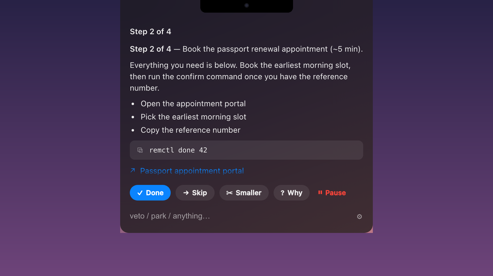
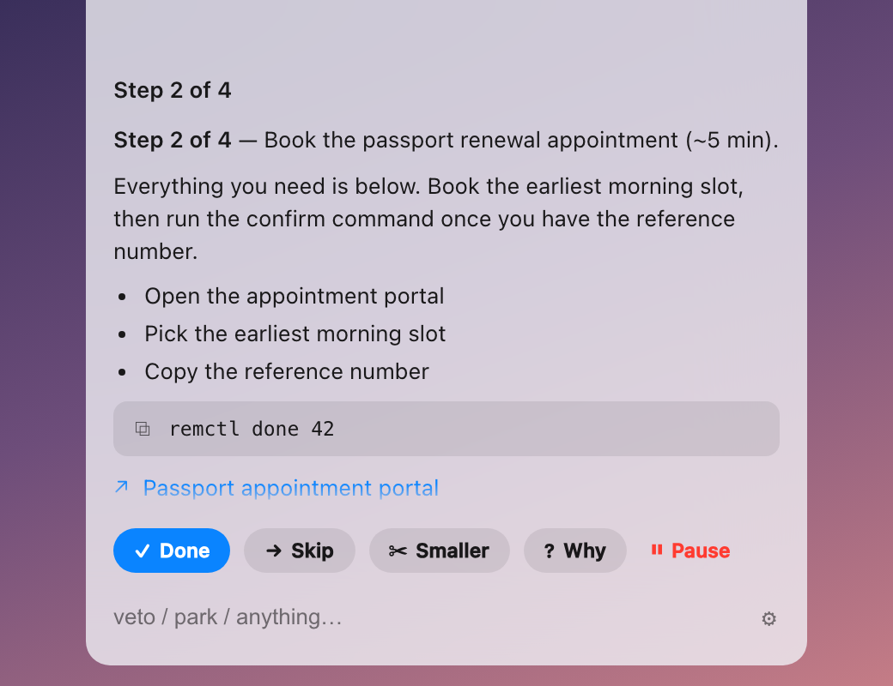
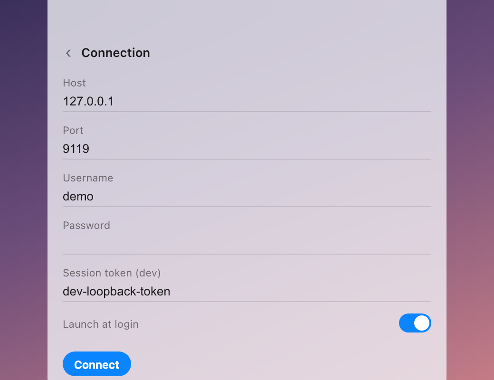

# Hermes Notch

A native macOS HUD for [Hermes Agent](https://github.com/NousResearch/hermes-agent)
that lives around the camera notch. It renders **widgets** — glanceable,
interactive cards backed by your Hermes skills — and sends your responses back
into live agent sessions. One hover, one glance, one click, back to work.


The reference widget wraps an ADHD-focus skill: the collapsed strip shows the
one step you should do next; hovering expands it into a card with copyable
commands and clickable links, and **Done / Skip / Smaller** buttons that go
straight to the agent session running the skill — which closes the task at
source and serves the next step.



Light mode follows the system automatically; settings live behind the gear —
host, credentials, autostart, nothing else:

| | |
|---|---|
|  |  |

## How it works

```
┌── Hermes Notch.app (any Mac) ────────────────────────────────┐
│ Tauri: non-activating NSPanel hugging the notch              │
│ · renders Cards, fires actions                               │
└──────┬────────────────────────────────────┬──────────────────┘
       │ HTTPS + session cookie             │ JSON-RPC WebSocket
┌──────┴────────────────────────────────────┴──────────────────┐
│ Hermes host: `hermes serve` (FastAPI, port 9119)             │
│ · hermes-notch plugin = widget host                          │
│   scans ~/.hermes/notch-widgets/*, runs state scripts,       │
│   normalizes everything to render-ready Cards                │
│ · /api/ws = the agent gateway — chat-backed widgets inject   │
│   protocol words (done, skip, …) into dedicated sessions     │
└──────────────────────────────────────────────────────────────┘
```

Widgets are declarative directories (`widget.json` + optional state script).
The intelligence stays on the host — deterministic scripts or agent sessions
produce **Cards**; the app is a dumb, pretty renderer. See
[docs/WIDGET_SPEC.md](docs/WIDGET_SPEC.md) — it's written so an AI agent can
author a widget from it, and the bundled
[notch-widgetizer skill](skills/notch-widgetizer/SKILL.md) does exactly that:
point it at any Hermes skill, recurring prompt, or cron job and it emits a
widget.

## Repo layout

| Path | What |
|---|---|
| `app/` | The Tauri app (macOS notch HUD) |
| `hermes-plugin/` | Hermes dashboard plugin — the widget host API |
| `widgets/` | Built-in widgets (`adhd-focus` reference implementation) |
| `skills/notch-widgetizer/` | Hermes skill that turns skills/prompts into widgets |
| `docs/` | [WIDGET_SPEC](docs/WIDGET_SPEC.md) · [PROTOCOL](docs/PROTOCOL.md) · [DESIGN](docs/DESIGN.md) |
| `scripts/install.sh` | Host-side installer (symlinks into `~/.hermes`) |

## Setup

### 1. Hermes host (the machine running Hermes Agent)

```bash
git clone https://github.com/czekaj/hermes-notch.git
cd hermes-notch && ./scripts/install.sh
```

The installer links the plugin, widgets, spec, and skill into `~/.hermes` and
enables the plugin. Then, because the dashboard refuses network binds without
auth, configure a password in `~/.hermes/config.yaml`:

```yaml
dashboard:
  basic_auth:
    username: you
    password_hash: "<hash>"     # see hermes docs; plaintext `password:` also works
    secret: "<stable 32-byte secret>"
```

and start the host: `hermes serve --host 0.0.0.0 --port 9119`.

### 2. The app (the Mac with the notch)

Requires Node 20+ and **Rust ≥ 1.88** (`rustup update stable`).

```bash
cd app && npm install && npm run tauri build   # or: npm run tauri dev
```

Launch, hover the notch, open settings (⚙), enter the host address and your
**dashboard credentials** (the same login as the Hermes web dashboard — Notch
is just another dashboard client), Connect. Same-machine dev shortcut: launch
`HERMES_DASHBOARD_SESSION_TOKEN=<token> hermes serve` and put the token in
the settings' token field instead of username/password.

On Macs without a notch (external displays), the strip renders as a floating
pill at the top-center of the screen instead.

## Writing widgets

Read [docs/WIDGET_SPEC.md](docs/WIDGET_SPEC.md) (5-minute read). Short version:

```
~/.hermes/notch-widgets/my-widget/
├── widget.json   # identity + source + actions
└── state.py      # prints one JSON Card to stdout
```

Validate with `python3 hermes-plugin/validate_widget.py <dir> --run`, install
by dropping the directory in `~/.hermes/notch-widgets/`, then
`POST /api/plugins/hermes-notch/rescan`.

Or let an agent do it: install the `notch-widgetizer` skill (the installer
already did) and tell Hermes *"widgetize my morning briefing"*.

## Security notes

- The dashboard fail-closes on non-loopback binds without an auth provider;
  Notch authenticates via password login → session cookie, and WebSocket
  connects use single-use 30-second tickets.
- Cards cross the network: widget scripts must never emit secrets.
- Widget state scripts execute on the host as your user — install widgets you
  trust, same as skills.
- App-side credential storage is a plain settings file for now (keychain is a
  tracked TODO); prefer a dedicated dashboard user for Notch.

## License

[MIT](LICENSE)
